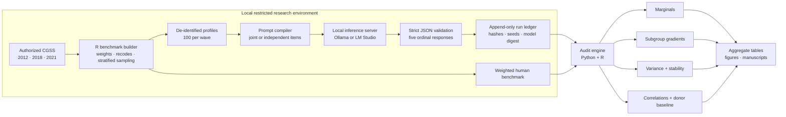
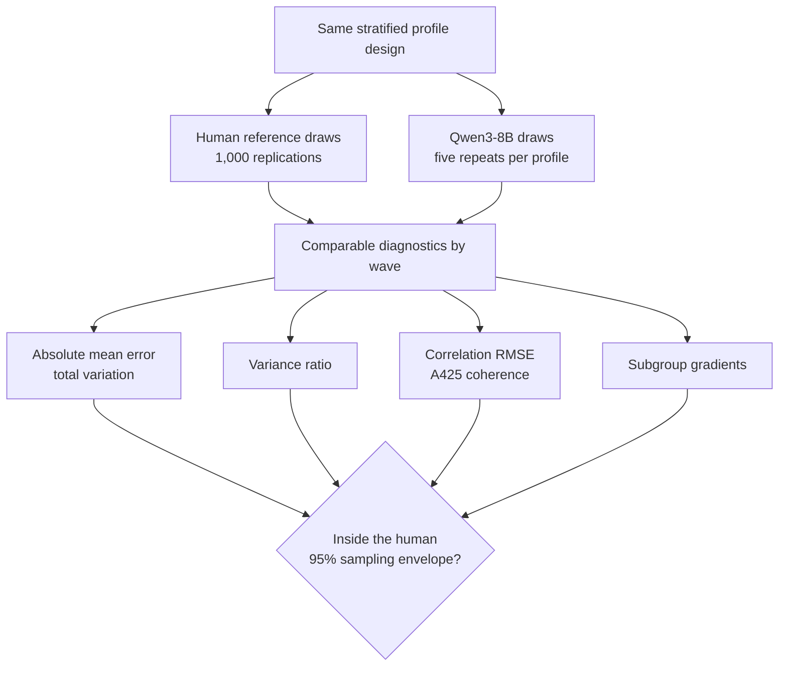
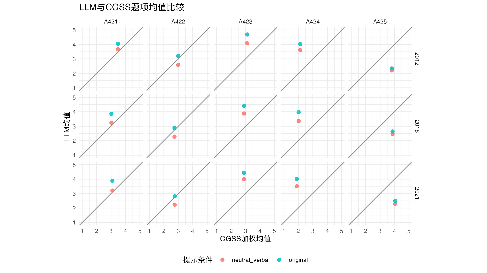
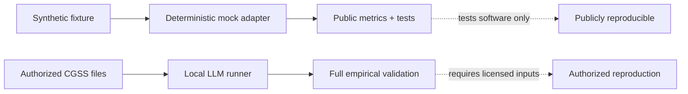

<div align="center">

# SurveyLLM-Eval

### Can an LLM reproduce a survey population—not just its average answer?

**An estimand-aware audit using three waves of CGSS gender-attitude data**

[](https://github.com/4b8wsfdk7y-cloud/cgss-gender-attitude-llm-audit/actions/workflows/ci.yml)
[](https://www.python.org/)
[](https://www.r-project.org/)
[](#system-architecture)
[](#data-and-reproducibility-boundary)
[](LICENSE)

[Why this audit](#why-this-audit) · [Architecture](#system-architecture) ·
[Results](#results-at-a-glance) · [Quick start](#public-quick-start) ·
[Full pilot](#run-the-authorized-pilot) · [Papers](#research-artifacts)

</div>

## Why this audit

LLM-generated “synthetic respondents” can sound plausible and still represent
the wrong population. A model may match an item mean while compressing
disagreement, distorting subgroup differences, or inventing correlations that
do not exist among human respondents.

This repository therefore treats the LLM as an **object of validation**, not a
replacement for respondents. It compares profile-conditioned model responses
with weighted human benchmarks from CGSS 2012, 2018, and 2021 at four levels:

| Evaluation target | Main diagnostic | Failure hidden by a mean-only comparison |
|---|---|---|
| Marginal fidelity | category distribution, mean error, total variation | Wrong response shape |
| Dispersion | variance ratio | Artificially homogeneous respondents |
| Heterogeneity | subgroup gradients, matched-profile error | Flattened or exaggerated social differences |
| Relational structure | correlation RMSE, joint-donor baseline | Invented coherence across attitudes |
| Stochastic behavior | repeated draws, within-profile stability | Confusing randomness with fidelity |

> **Core principle:** stability is not validity. A model can be consistently
> wrong, and repeated sampling cannot repair a misspecified response structure.

## System architecture

The research path keeps licensed microdata local. Only de-identified profile
descriptions enter a locally served model; the public repository contains no
respondent-level CGSS records or profile-linked model logs.



The model runner is deliberately defensive:

- prompt, configuration, and model digests prevent incompatible runs from
  being silently mixed;
- deterministic seeds and an append-only JSONL ledger make interrupted runs
  resumable;
- strict response schemas reject missing, extra, or out-of-range answers;
- local inference keeps licensed microdata and derived profiles off external
  APIs;
- the public mock adapter tests software behavior without masquerading as an
  empirical LLM result.

See [`docs/architecture.md`](docs/architecture.md) for the package-level design.

## Frozen experiment

| Component | Frozen core configuration |
|---|---|
| Survey benchmark | CGSS 2012, 2018, and 2021 |
| Attitude battery | five ordinal gender-attitude items, A421–A425 |
| Profile sample | 300 total: 100 stratified profiles per wave |
| Local model | `qwen3:8b` served through Ollama |
| Primary prompt | `neutral_verbal` |
| Repeated generation | five independently seeded joint draws per profile |
| Human reference | 1,000 replications of the same stratified sampling design |
| Reliability | 1,820 of 1,821 recorded calls succeeded across pilot conditions |

`qwen/qwen3.5-9b` through LM Studio is retained as a **candidate follow-up** in
`config_qwen35_lmstudio.json`. It is not relabeled as the source of the frozen
results below.

## Evaluation design

Each diagnostic is tied to a distinct estimand. The human sampling envelope
asks how much error the same 100-profile-per-wave design would produce if it
sampled humans rather than generated answers.



The envelope is a **reference distribution**, not a confidence interval for a
universal model effect. The matched-profile and donor analyses answer different
questions and are reported separately.

## Results at a glance

Across all three waves, every reported Qwen marginal, dispersion, and
relational diagnostic falls outside its corresponding 95% human-sampling
envelope.

| Diagnostic | Qwen estimate across waves | Human 95% reference | Reading |
|---|---:|---:|---|
| Absolute mean error ↓ | 0.880–1.021 | upper bound 0.160–0.168 | Large marginal error |
| Total variation ↓ | 0.514–0.571 | upper bound 0.100–0.104 | Wrong category distributions |
| Variance ratio → 1 | 0.441–0.592 | 0.846–1.141 | Strong variance compression |
| Correlation RMSE ↓ | 0.279–0.298 | upper bound 0.137–0.141 | Wrong joint structure |
| A425 mean absolute correlation ↓ | 0.437–0.507 | upper bound 0.198–0.234 | Excessive cross-item coherence |



*The diagonal denotes equality between weighted CGSS and model means. This is
one diagnostic; matching means alone would not establish population fidelity.*

Three findings matter most:

1. **Neutral prompting helps but does not solve the problem.** It reduces mean
   error relative to the original prompt, while the model remains outside the
   human reference envelope.
2. **Repeated draws restore some randomness, not the human distribution.** The
   mean variance ratio is `0.466`, so the generated population remains much
   less heterogeneous than CGSS.
3. **The main failure is structural.** A stratified joint-donor baseline that
   preserves complete human response vectors recovers variance and covariance
   much more closely. Fluent profile conditioning alone is insufficient.

The independent-item ablation reduces A425 coherence by `0.096` on average,
but its profile-bootstrap interval includes zero, and several item-wave cells
become constant or nearly constant. It is exploratory evidence, not a causal
isolation of prompt context.

## Public quick start

The public demo requires no CGSS data, model download, or API key. It uses a
clearly labeled synthetic fixture and deterministic mock adapter to exercise
the package, schemas, metrics, report generation, and CLI.

```bash
git clone https://github.com/4b8wsfdk7y-cloud/cgss-gender-attitude-llm-audit.git
cd cgss-gender-attitude-llm-audit
python3 -m venv .venv
source .venv/bin/activate
python -m pip install --editable .
survey-llm-eval demo --output-dir output/public_demo
python -m unittest discover -s tests -v
```

Expected CLI summary:

```json
{
  "benchmark": "CGSS gender-attitude audit",
  "demo_only": true,
  "human_records": 12,
  "model_records": 36,
  "output_dir": "output/public_demo"
}
```

The demo writes `output/public_demo/demo_report.json` and
`mock_responses.csv`. These are software fixtures—not CGSS findings or model
benchmark results.



## Run the authorized pilot

### 1. Build the restricted benchmark

Set the directory containing authorized `CGSS2012.dta`, `CGSS2018.dta`, and
`CGSS2021.dta` files:

```bash
export CGSS_RAW_DIR="/absolute/path/to/authorized/cgss/files"
Rscript scripts/00_build_authorized_benchmark.R
```

The generated `data/source/dimension_pilot_results.rds` remains restricted.
Inspect `PUBLIC_RELEASE_MANIFEST.md` before sharing the project.

### 2. Inspect the prepared model inputs

```bash
Rscript scripts/01_prepare_profiles.R
```

The script prints the first ten de-identified profiles before writing the full
pilot input. Inspect those rows before starting inference.

### 3. Run local inference

Start Ollama with `qwen3:8b`, then run the primary condition explicitly:

```bash
python3 scripts/02_run_local_llm.py \
  --config config.json \
  --conditions neutral_verbal \
  --repeats 5
```

The runner appends one record per completed call and skips matching
`profile_id × condition × repeat` keys on restart. Use a separate output
directory for every model configuration:

```bash
python3 scripts/02_run_local_llm.py \
  --config config_qwen35_lmstudio.json \
  --output-dir output/qwen35_followup \
  --conditions neutral_verbal \
  --repeats 5
```

### 4. Evaluate and regenerate figures

```bash
Rscript scripts/03_evaluate_audit.R
Rscript scripts/05_extended_validation.R
Rscript paper/reproduce.R
```

## Follow-up experiments

The joint runner presents all five items in one prompt. The independent-item
runner presents exactly one item per fresh call, repeats the full persona, and
uses no conversation history:

```bash
python3 scripts/04_run_independent_items.py
```

The prespecified exploratory contrast is:

```text
delta_r = mean_abs_correlation_joint - mean_abs_correlation_independent
```

A profile-bootstrap interval entirely above zero would support
context-induced coherence. The realized design contains one independent answer
but five joint repeats per profile-item, so it does not isolate prompt context
from decoding variability or model representation.

The extended validation also includes:

- survey-weighted Pearson correlations, with unweighted Pearson and polychoric
  sensitivity estimates;
- a stratified joint-donor benchmark matching wave, sex, education group, and
  urban residence;
- matched human and supervised-ML reference models;
- profile-level bootstrap resampling that keeps all five items and repeats
  together.

## Repository map

```text
survey-llm-eval/
├── src/survey_llm_eval/   reusable schemas, metrics, run guards, and CLI
├── benchmarks/            declarative benchmark specification
├── fixtures/              synthetic public-demo records
├── tests/                 dependency-free unit tests
├── scripts/               CGSS preparation, local inference, and R evaluation
├── prompts/               versioned prompt conditions
├── ml/                    supervised human-response benchmarks
├── output/                aggregate metrics and public figures
├── paper/                 manuscripts, supplement, and reproduction script
├── presentation/          PPE forum presentation
└── docs/                  architecture and reproducibility notes
```

## Tested environment

- R 4.5.2; package versions are recorded in
  `environment/R-session-info.txt`
- Python 3.10 or later; the LLM runners use the standard library only
- supervised ML dependencies are pinned in `ml/requirements.txt`
- frozen results: `qwen3:8b` through Ollama, configured in `config.json`
- candidate follow-up: `qwen/qwen3.5-9b` through LM Studio, configured in
  `config_qwen35_lmstudio.json`

## Main outputs

| Path | Contents | Public? |
|---|---|---|
| `output/metrics_*.csv` | aggregate validation diagnostics | Yes |
| `output/figures/` | aggregate comparison figures | Yes |
| `paper/` | manuscripts, supplement, bibliography, final PDFs | Yes |
| `data/profiles_pilot.csv` | sampled profiles with held-out responses | No |
| `data/profiles_llm_input.csv` | model-facing derived profiles | No |
| `output/responses*.jsonl` | immutable profile-linked model logs | No |

## Research artifacts

- [`paper/chinese-audit-paper.pdf`](paper/chinese-audit-paper.pdf) — Chinese
  research paper
- [`paper/main_showcase.pdf`](paper/main_showcase.pdf) — English showcase
  manuscript
- [`presentation/ppe-forum-presentation.pdf`](presentation/ppe-forum-presentation.pdf)
  — PPE forum presentation connecting the survey study and LLM audit
- [`paper/online_supplement.pdf`](paper/online_supplement.pdf) — methods and
  robustness supplement

## Data and reproducibility boundary

The public repository fully reproduces the synthetic demo, Python package,
tests, benchmark schema, and metric calculations. Reproducing the empirical
CGSS comparison requires licensed CGSS microdata and the restricted derived
files rebuilt from them.

The repository does **not** redistribute respondent records, derived profiles,
or profile-linked model outputs. A passing CI workflow verifies software
behavior; it does not validate synthetic respondents or recreate the paper's
numerical findings. See
[`docs/reproducibility-boundary.md`](docs/reproducibility-boundary.md).

## Interpretation boundary

These findings apply to one frozen local model and experimental design. They do
not establish that all LLMs fail, that model architecture alone caused the
errors, or that a joint-donor baseline is an optimal predictor. Profile-level
errors are descriptive and are not estimates of individual latent attitudes.

The evidence supports auditing model-generated survey responses along several
estimands. It does **not** support replacing human respondents.

## Citation

When reusing the audit design or code, cite this repository and the
accompanying paper. Cite CGSS, model providers, and third-party packages
separately under their own terms. Machine-readable metadata is available in
[`CITATION.cff`](CITATION.cff).

## License

Code is released under the [MIT License](LICENSE). Data and third-party
materials remain subject to their original terms.
