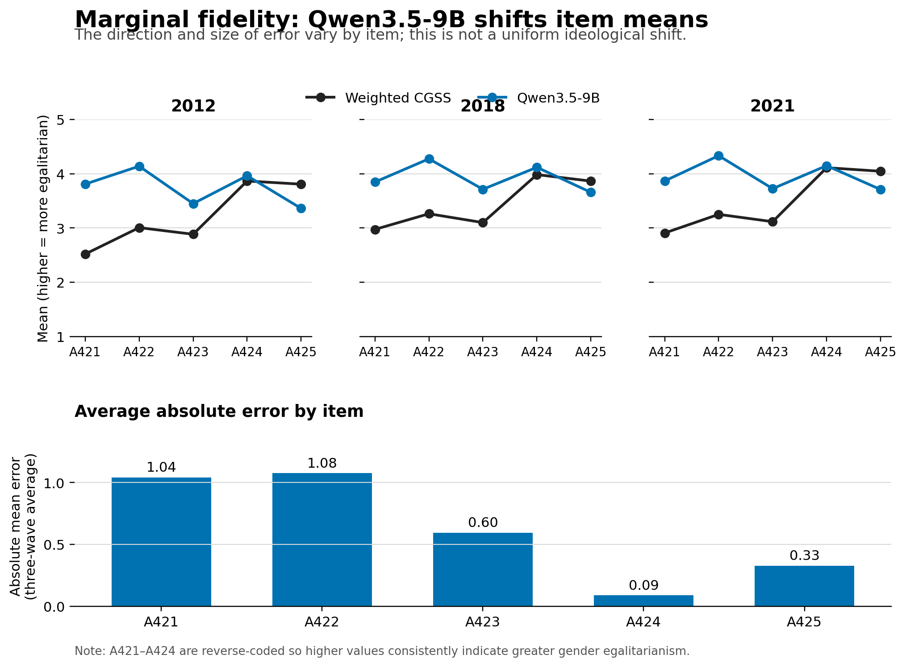
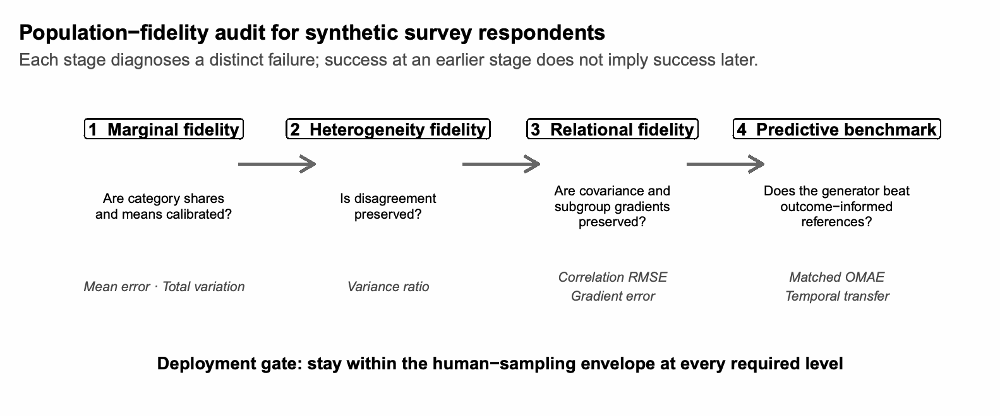
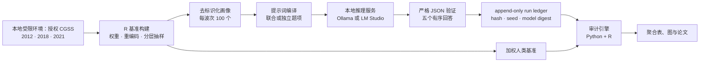
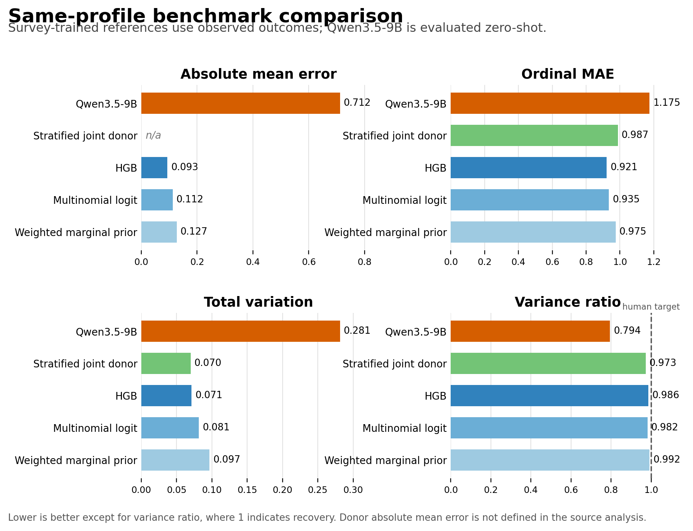

<div align="center">

# SurveyLLM-Eval

### 仅凭人口学特征，LLM 能否复现真实问卷人群？

**对 Qwen3.5-9B 与 31,856 名 CGSS 受访者的可复现审计**

[](https://www.python.org/)
[](https://www.r-project.org/)
[](README.md#system-architecture)
[](README.md#data-and-reproducibility-boundary)
[](LICENSE)

[English](README.md) · [中文](README.zh-CN.md)

[20 秒结论](#20-秒结论) · [我做了什么](#我做了什么) · [系统架构](#系统架构) ·
[核心结果](#核心结果) · [公开演示](#公开演示) · [数据边界](#数据与复现边界)

</div>

## 项目概览

这个项目检验的不是 LLM 能否生成“像人说的话”，而是它能否在总体层面复现真实受访者群体。我向本地运行的 Qwen3.5-9B 提供 300 个去标识化人口学画像，分别来自 CGSS 2012、2018 和 2021 的分层样本；模型从未看到这些人的真实态度。每个画像在五个性别态度题项上接受五次独立生成。

生成的人群与 31,856 名真实受访者的加权基准进行比较，同时纳入同规模重复人类抽样、问卷训练的机器学习模型与 joint-donor 基线。审计不止比较均值，还比较类别分布、画像间稳定差异、态度关系结构和重复生成的随机性。

结论是混合但总体否定的：Qwen3.5-9B 在一个波次上复现了总体方差，但 12 个波次级核心诊断中仍有 11 个落在同等人类抽样的 95% 参考范围之外。

## 20 秒结论

Qwen3.5-9B 能生成流畅、会随画像变化的回答，却没有复现被调查的人群。在 CGSS 三个波次中，12 个核心诊断有 11 个超出对应的人类抽样参考范围；只有 2012 年的方差比落入范围内。

| 均值误差 ↓ | 分布误差 ↓ | 方差恢复 → 1 | 相关误差 ↓ |
|---:|---:|---:|---:|
| **0.569–0.707** | **0.214–0.268** | **0.668–0.975** | **0.143–0.192** |
| 人类上界：0.168 | 人类上界：0.104 | 人类范围：0.846–1.141 | 人类上界：0.141 |



相较于早期 Qwen3-8B 实验，Qwen3.5-9B 的方差恢复明显改善；但项目发现的剩余误差仍是结构性的：题项均值与类别份额失真，画像间的稳定社会差异较弱，联合提示还会使态度之间比 CGSS 中更一致。

## 我做了什么

| 层次 | 实现 | 说明 |
|---|---|---|
| 本地推理 | Ollama / LM Studio adapter、严格 JSON schema、保存采样请求 | 不把受限数据发送到外部 API |
| 运行可靠性 | append-only JSONL ledger、prompt/config/model hash、断点续跑 | 保留实验来源与运行轨迹 |
| 评估 | Python 包与 survey-weighted R 分析 | 检验边际、子群体、方差、相关、稳定性和预测表现 |
| 基准 | 人类抽样包络、joint-donor、监督学习基线 | 区分稀疏画像的限制与生成器本身的失败 |
| 公开发布 | 合成 fixture、CLI、tests、CI、清晰的数据边界 | 在不重发许可微观数据的前提下保持可复现 |



## 为什么这样审计

“合成受访者”听起来合理，不等于代表了正确的人群。模型可能碰巧匹配一项平均数，却压缩分歧、扭曲群体差异，或生成真实人群中并不存在的态度相关性。因此，本项目把 LLM 当作需要验证的对象，而不是受访者的替代品。

| 被检验的对象 | 主诊断 | 仅看均值会漏掉什么 |
|---|---|---|
| 边际保真度 | 类别分布、均值误差、total variation | 回答形状错误 |
| 离散程度 | 方差比 | 人群被人为同质化 |
| 异质性 | 子群体梯度、matched-profile error | 社会差异被压平或夸大 |
| 关系结构 | correlation RMSE、joint-donor 基线 | 被虚构的态度一致性 |
| 随机行为 | 重复抽样、同画像稳定性 | 把随机性误认为保真度 |

> **核心原则：稳定不等于有效。** 模型可以稳定地错；多次采样不能修复错误的回答结构。

## 系统架构

受许可保护的微观数据始终留在本地环境。只有去标识化画像进入本地模型服务；公开仓库不包含受访者级 CGSS 数据或可回连画像的模型日志。



冻结实验使用 `qwen/qwen3.5-9b`、`neutral_verbal` 主提示、300 个画像和每个画像五次新的随机联合调用；全部 1,500 次主调用成功。LM Studio 未确认请求的 seed 是否实际生效，因此重复结果被视为新的随机调用，而非严格可复现的固定 seed 抽样。

完整模块设计见 [`docs/architecture.md`](docs/architecture.md)。

## 核心结果

| 诊断 | Qwen 三个波次的估计 | 人类 95% 参考范围 | 解读 |
|---|---:|---:|---|
| 绝对均值误差 ↓ | 0.569–0.707 | 上界 0.160–0.168 | 边际均值误差大 |
| Total variation ↓ | 0.214–0.268 | 上界 0.100–0.104 | 类别分布错误 |
| 方差比 → 1 | 0.668–0.975 | 0.846–1.141 | 有改进但跨波次不稳定 |
| Correlation RMSE ↓ | 0.143–0.192 | 上界 0.137–0.141 | 联合结构错误 |
| A425 平均绝对相关 ↓ | 0.232–0.335 | 上界 0.198–0.234 | 跨题项一致性过强 |



最重要的三点是：偏误不是单向意识形态移动，而是题项特异的；重复调用恢复的是随机性多于画像间稳定差异；稀疏画像也不是唯一原因，监督学习和 joint-donor 基线都能显著降低相应误差。

## 公开演示

公开 demo 不需要 CGSS 数据、模型下载或 API key。它使用明确标为合成的 fixture 与确定性的 mock adapter，覆盖 package、schema、边际和关系指标、报告生成与 CLI。

```bash
python -m pip install -e ".[dev]"
survey-llm-eval demo
pytest -q
```

如需在获授权的本地环境运行完整实验，请按英文 README 的 [Full pilot](README.md#run-the-authorized-pilot) 说明准备 CGSS 数据、模型服务和配置。该路径不会也不应在公开环境中运行。

## 数据与复现边界

- CGSS 微观数据受许可限制，仓库不分发原始记录、去标识化画像或画像级输出；
- 公开 demo 的数据与结果均为合成，仅用于验证软件流程；
- README 中报告的 CGSS 聚合结果和图表来自获授权的本地实验；
- 可复现并不意味着可公开原始数据。完整说明见 [`docs/reproducibility-boundary.md`](docs/reproducibility-boundary.md)。

## 研究材料、引用与许可

随仓库提供的论文、演示和引用信息见英文版的 [Research artifacts](README.md#research-artifacts) 与 [Citation](README.md#citation)。代码采用 MIT License；数据及相关衍生材料仍受原始许可条款约束。
