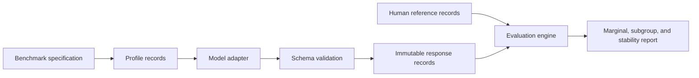

# Architecture

The public repository separates reusable evaluation code from the restricted
CGSS case study.

## Public path

`survey-llm-eval demo` uses a small synthetic human-reference fixture and a
deterministic mock adapter. It verifies installation, schemas, metrics, report
generation, and the command-line interface. It is not an LLM benchmark result.

## Authorized research path

The existing `scripts/` pipeline rebuilds the matched CGSS benchmark from
licensed microdata, calls a locally served model, and runs the full R
validation ladder. Respondent-derived profiles and response logs remain local.

## Design decisions

- The benchmark definition is configuration, not hard-coded evaluation logic.
- Repeated generation is grouped at the profile level.
- Stability is reported separately from fidelity: a consistently wrong model
  is stable but not valid.
- Public tests exercise deterministic code and never require a model endpoint.
